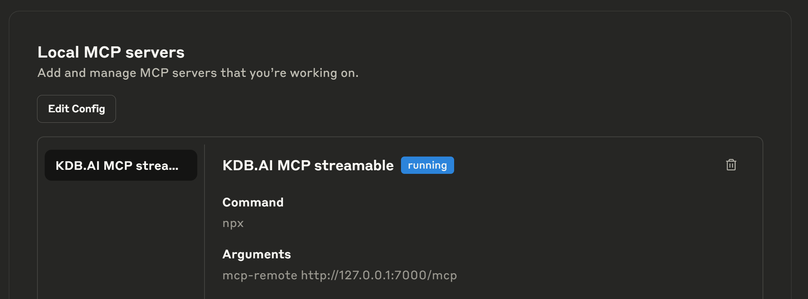
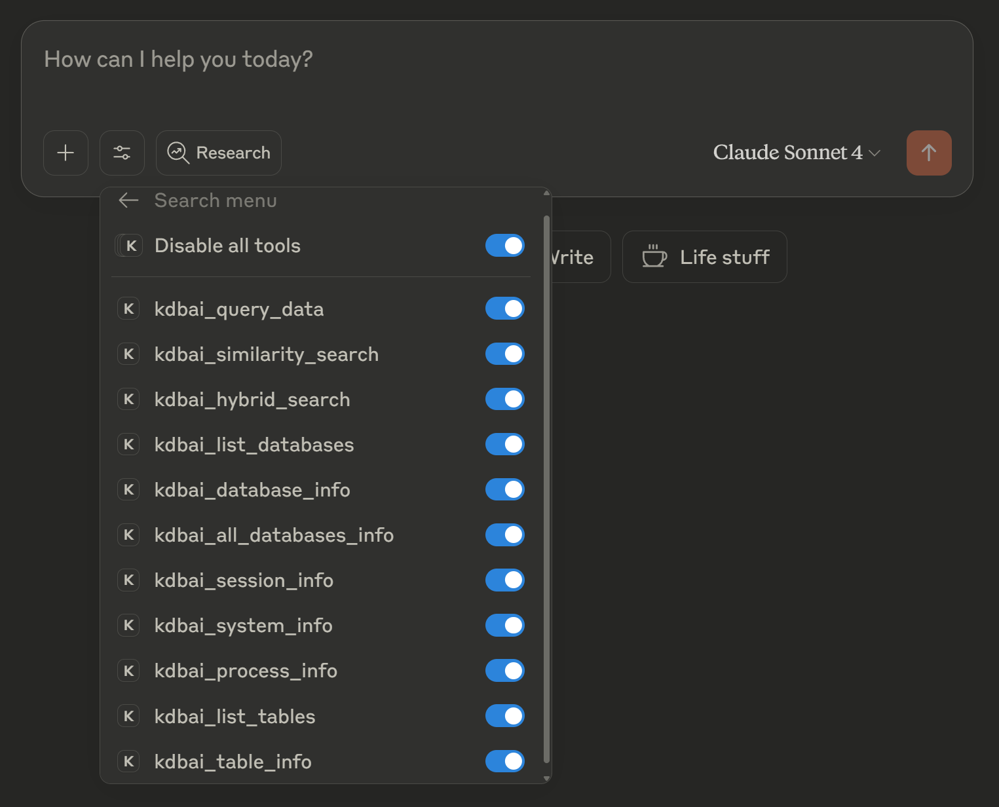
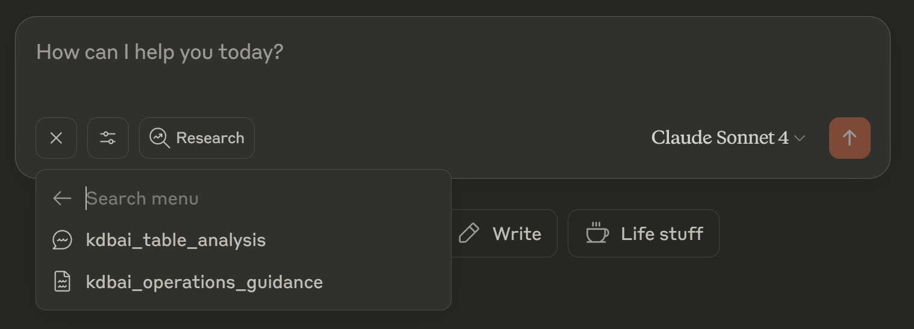

# KDB.AI MCP Server

A KDB.AI MCP (Model Context Protocol) Server that enables interaction with KDB.AI through natural language for seamless vector database operations, vector similarity searches, hybrid search operations, and advanced data analysis.

Built on an extensible framework with configurable templates, it allows for intuitive extension with custom integrations tailored to your specific vector search and AI-powered data needs. The server leverages a combination of curated resources, intelligent prompts, and robust tools to provide appropriate guidance for AI models interacting with KDB.AI.

## Table of Contents

- [Supported Environments](#supported-environments)
- [Prerequisites](#prerequisites)
- [Quickstart](#quickstart)
- [Features](#features)
- [MCP Server Installation](#mcp-server-installation)
- [Security Considerations](#security-considerations)
- [Transport Options](#transport-options)
- [Command Line Tool](#command-line-tool)
- [Configure Embeddings](#configure-embeddings)
- [Usage with Claude Desktop](#usage-with-claude-desktop)
- [Prompts/Resources/Tools](#promptsresourcestools)
- [Development](#development)
- [Testing](#testing)
- [Troubleshooting](#troubleshooting)
- [Useful Resources](#useful-resources)

## Supported Environments

The following table shows the install options for supported Operating Systems:

| **Primary OS** | **KDB.AI** | **MCP Server** | **UV/NPX** | **Claude Desktop**               | **Alternative MCP Client**                                  |
| -------------- | ---------- | -------------- | ---------- | -------------------------------- | ----------------------------------------------------------- |
| **Mac**        | ✅ Docker  | ✅ Local       | ✅ Local   | ✅ Local (streamable-http/stdio) | ✅ [Other clients](https://modelcontextprotocol.io/clients) |
| **Linux**      | ✅ Docker  | ✅ Local       | ✅ Local   | ❌ Not supported                 | ✅ [Other clients](https://modelcontextprotocol.io/clients) |
| **WSL**        | ✅ Docker  | ✅ Local       | ✅ Local   | ❌ Not supported                 | ✅ [Other clients](https://modelcontextprotocol.io/clients) |
| **Windows**    | ✅ Docker  | ✅ Local       | ✅ Local   | ✅ Local (streamable-http only)  | ✅ [Other clients](https://modelcontextprotocol.io/clients) |
| **Windows**    | ✅ Docker  | ⚠️ WSL         | ✅ Local   | ✅ Local (streamable-http only)  | ✅ [Other clients](https://modelcontextprotocol.io/clients) |

## Prerequisites

Before installing and running the KDB.AI MCP Server, ensure you have:

- [Cloned this repo](#clone-the-repository)
- A suitable container runtime installed - we recommend [Docker Desktop](https://docs.docker.com/desktop/) or [Rancher-Desktop](https://docs.rancherdesktop.io/getting-started/installation)
  - For Windows users we recommend installing Docker desktop using the WSL2 integration [as outlined here](https://docs.docker.com/desktop/features/wsl/)
- [Signed up for KDB.AI](https://docs.kx.com/kdb-ai-latest/KDB_AI/Get_Started/kdb-ai-server-setup.htm#sign-up)
  - Follow the [Server Setup Guide](https://docs.kx.com/kdb-ai-latest/KDB_AI/Get_Started/kdb-ai-server-setup.htm) to get up and running quickly.
  - See supporting [KDB.AI documentation](https://docs.kx.com/kdb-ai-latest/KDB_AI/home.htm) for additional information
- [UV Installed](https://docs.astral.sh/uv/getting-started/installation/) for running the KDB.AI MCP Server - available on Windows/Mac/Linux/WSL
- [Claude Desktop installed](https://claude.ai/download) or another MCP-compatible client, that will connect to the KDB.AI MCP Server - available on Windows/Mac
- [NPX installed](https://nodejs.org/en) - required to use `streamable-http` transport with Claude Desktop
  - `npx` may not be required if you are using a different MCP Client - consult the documentation of your chosen MCP Client
  - `npx` comes bundled with the [nodejs](https://nodejs.org/en) installer - available on Windows/Mac/Linux/WSL
  - See [example configuration with streamable-http](#example-configuration-with-streamable-http)

To simplify getting started we recommend running your MCP Client, KDB.AI MCP server and your KDB.AI database in the same internal Network. See [Security Considerations](#security-considerations) for more information.

## Quickstart

To demonstrate basic usage of the KDB.AI MCP Server, using an empty KDB.AI database, follow the quickstart steps below.

> Note: Ensure you have followed the necessary [prerequisites steps](#prerequisites)

1. Start your KDB.AI Server - follow the getting started steps from [KDB.AI Server setup guide](https://docs.kx.com/kdb-ai-latest/KDB_AI/Get_Started/kdb-ai-server-setup.htm)

2. Test connectivity to the KDB.AI Server

   If you have setup KDB.AI Server following step 1, your endpoint will be `http://localhost:8082`, otherwise update to your configured endpoint.

   ```bash
   uv run --with kdbai-client --python=3.12 python -c "import kdbai_client as kx; session = kx.Session(endpoint='http://localhost:8082'); print(session.version())"
   ```

   If you see a response like the below, your KDB.AI Server is configured correctly - please proceed to the next step. If you see different version numbers that's ok.

   ```python
   {'serverVersion': 'latest', 'clientMinVersion': '1.7.0', 'clientMaxVersion': 'latest'}
   ```

   If you get error message like `Error during creating connection...`, this usually indicates that either

   - KDB.AI Server is not running
   - KDB.AI Server is not accepting connection

   See the [troubleshooting](#troubleshooting) section for more details


3. [Configure Claude Desktop](#configure-claude-desktop) with your chosen transport.

4. [Configure Embeddings](#configure-embeddings) with your chosen embeddings provider and model.

5. [Start your MCP server](#mcp-server-installation).

   If you have configured Claude Desktop with [stdio transport](#example-configuration-with-stdio), then this step is not required. Please move to the next step (Claude Desktop will manage starting the MCP Server for you).

   ```bash
   uv run mcp-server
   ```

6. Start Claude Desktop and verify that the tools and prompts outlined in the [Validate Claude Desktop Config](#validate-claude-desktop-config) section are visible.

7. Create some tables and add some data following the [KDB.AI Quickstart Guide](https://docs.kx.com/kdb-ai-latest/KDB_AI/Get_Started/quick-start.htm)

8. Load [kdbai_operations_guidance](#resources) resource. This will give your MCP client some guidance on how to interact with your KDB.AI database.

9. Try the `kdbai_table_analysis` prompt and generate an analysis prompt for one of your tables.

10. Ask questions in natural language: Interact with your KDB.AI database using plain English. Your MCP client will use one or more of the [available tools](#tools) to answer your questions.


## Features

- **Similarity Search**: Similarity Search on embedded text within vector database, based on index(s) built at the KDBAI server
- **Hybrid Search**: Hybrid search on sparse and dense indices built at the KDBAI server
- **Customizable Query and Search Result Optimization**: Customizable query and search including result truncation (query only), filtering, grouping, aggregation, sorting
- **Query Guidance for LLM**: Comprehensive LLM-ready MCP resource (file://kdbai_operations_guidance) with syntax examples and best practices
- **Database Schema Discovery**: Explore and understand your database tables and structure using the included MCP resource for quick, intelligent insights.
- **Auto-Discovery System**: Automatic discovery and registration of tools, resources, and prompts from their respective directories
- **Ready-Made Extension Template**: Ready-to-use templates for tools, resources, and prompts with best practices and documentation for extending functionality
- **Unified Intelligence: Prompts, Tools & MCP Resources Working Together**: A powerful combination of intelligent prompts, purpose-built tools, and curated MCP resources—all working together to deliver fast, optimized, and context-aware results.
- **HTTP Streamable Protocol Support**: Supports the latest MCP streamable HTTP protocol for efficient data flow, while automatically blocking the deprecated SSE protocol.

## MCP Server Installation

### Clone the repository

```bash
git clone https://github.com/KxSystems/kdbai-mcp-server.git
cd kdbai-mcp-server
```

### Run the MCP server

#### Install dependencies

```bash
uv sync
```

This step is optional, but can be useful when starting the MCP server for the first time or after adding new dependencies.

If you do not run `uv sync` first, the MCP client can timeout waiting for the dependencies to be installed.

This can be caused by packages like `sentence-transformers` with large dependencies.

#### Run the server

```bash
uv run mcp-server
```

## Transport Options

For more info on the supported transports see official documentation

- [streamable-http](https://modelcontextprotocol.io/docs/concepts/transports#streamable-http)
- [stdio](https://modelcontextprotocol.io/docs/concepts/transports#standard-input%2Foutput-stdio)

> Note: We don't support [sse](https://modelcontextprotocol.io/docs/concepts/transports#server-sent-events-sse-deprecated) transport (server-sent events) as it has been deprecated since protocol version 2024-11-05.

## Security Considerations

To simplify getting started, we recommend running your MCP Client, KDB.AI MCP server, and your KDB.AI database on the same internal network.

### Encrypting Database Connections

If you require an encrypted connection between your KDB.AI MCP server and your KDB.AI database, you can enable the following options:
- **QIPC with TLS**: Use flag `--db.qipc-tls=true`
- **REST with HTTPS**: Use flag `--db.rest-protocol=https`

Both require setting up a TLS/HTTPS proxy ([envoy](https://www.envoyproxy.io/), [nginx](https://nginx.org/)) in front of KDB.AI as a prerequisite:

  - Since the proxy will terminate TLS connections, we recommend that the proxy runs on the same host as your KDB.AI Server
  - The proxy will need its own certificates - If you do not have your own certificates you can create self-signed certificates for internal use. See an [example of creating self-signed certificates](https://www.digitalocean.com/community/tutorials/how-to-create-a-self-signed-ssl-certificate-for-nginx-in-ubuntu-20-04-1) that can be used with your proxy
  - For QIPC connections using self signed certificates:
      - You will need to specify the location of your self signed CA cert
      - Set `KX_SSL_CA_CERT_FILE` environment variable to point to the CA cert file that your proxy is using
      - Alternatively, you can bypass certificate verification by setting `KX_SSL_VERIFY_SERVER=NO` for development and testing
  - For Kubernetes: Consider using a service mesh like [istio](https://istio.io/) for simplified certificate management

### Encrypting MCP Client Connections

If you require an encrypted connection between your MCP Client and your KDB.AI MCP server:

- The KDB.AI MCP server uses `streamable-http` transport by default and starts a localhost server at `127.0.0.1:7000`. We do not recommend exposing this externally.
- You can optionally setup an HTTPS proxy in front of your KDB.AI MCP server such as [envoy](https://www.envoyproxy.io/) or [nginx](https://nginx.org/) for HTTPS termination
- FastMCP v2 was evaluated for it's authentication features, but will remain temporarily on v1 to preserve broad model compatibility until clients/models catch up, at which point we’ll transition.
- When using `stdio` transport, this is not required as communication is through standard input/output streams on the same host


## Command Line Tool

The KDB.AI MCP Server provides a detailed help text explaining all configuration options.


```bash
uv run mcp-server -h
usage: mcp-server [-h] [--mcp.server-name str] [--mcp.log-level {DEBUG,INFO,WARNING,ERROR,CRITICAL}]
                  [--mcp.transport {stdio,streamable-http}] [--mcp.port int] [--mcp.host str] [--db.host str]
                  [--db.port int] [--db.username str] [--db.password SecretStr] [--db.mode {rest,qipc}]
                  [--db.rest-protocol {http,https}] [--db.qipc-tls bool] [--db.database-name str] [--db.retry int]
                  [--db.k int] [--db.vector-weight float] [--db.sparse-weight float] [--db.embedding-csv-path str]

KDB.AI MCP Server that enables interaction with KDB.AI

options:
  -h, --help            show this help message and exit

mcp options:
  MCP server configuration and transport settings

  --mcp.server-name str
                        Name identifier for the MCP server instance [env: KDBAI_MCP_SERVER_NAME] (default:
                        KDBAI_MCP_Server)
  --mcp.log-level {DEBUG,INFO,WARNING,ERROR,CRITICAL}
                        Logging verbosity level [env: KDBAI_MCP_LOG_LEVEL] (default: INFO)
  --mcp.transport {stdio,streamable-http}
                        Communication protocol: 'stdio' (pipes) or 'streamable-http' (HTTP server) [env:
                        KDBAI_MCP_TRANSPORT] (default: streamable-http)
  --mcp.port int        HTTP server port - ignored when using stdio transport [env: KDBAI_MCP_PORT] (default: 7000)
  --mcp.host str        HTTP server bind address - ignored when using stdio transport [env: KDBAI_MCP_HOST] (default:
                        127.0.0.1)

db options:
  KDB.AI database connection and search configuration

  --db.host str         KDB.AI server hostname or IP address [env: KDBAI_DB_HOST] (default: 127.0.0.1)
  --db.port int         KDB.AI server port number [env: KDBAI_DB_PORT] (default: 8082)
  --db.username str     Username for KDB.AI authentication [env: KDBAI_DB_USERNAME] (default: )
  --db.password SecretStr
                        Password for KDB.AI authentication [env: KDBAI_DB_PASSWORD] (default: )
  --db.mode {rest,qipc}
                        API mode: 'qipc' (fast binary protocol) or 'rest' (HTTP API) [env: KDBAI_DB_MODE] (default:
                        qipc)
  --db.rest-protocol {http,https}
                        Select protocol for REST mode, not considered for QIPC mode [env: KDBAI_DB_REST_PROTOCOL]
                        (default: http)
  --db.qipc-tls bool    Enable TLS for QIPC mode, not considered for REST mode. When using TLS with QIPC you will need
                        to set the environment variable `KX_SSL_CA_CERT_FILE` that points to the certificate on your
                        local filesystem that your TLS proxy is using. For local development and testing you can set
                        `KX_SSL_VERIFY_SERVER=NO` to bypass this requirement [env: KDBAI_DB_QIPC_TLS] (default: False)
  --db.database-name str
                        Default database name to use for operations [env: KDBAI_DB_DATABASE_NAME] (default: default)
  --db.retry int        Number of connection retry attempts on failure [env: KDBAI_DB_RETRY] (default: 2)
  --db.k int            Default number of results to return from vector searches [env: KDBAI_DB_K] (default: 5)
  --db.vector-weight float
                        Weight for vector similarity in hybrid search (0.0-1.0) [env: KDBAI_DB_VECTOR_WEIGHT]
                        (default: 0.7)
  --db.sparse-weight float
                        Weight for text similarity in hybrid search (0.0-1.0) [env: KDBAI_DB_SPARSE_WEIGHT] (default:
                        0.3)
  --db.embedding-csv-path str
                        Path to embeddings csv [env: KDBAI_DB_EMBEDDING_CSV_PATH] (default:
                        src/mcp_server/utils/embeddings.csv)
```

### CLI Configuration Options

The command line options are organized into two main categories:

- MCP Options - Controls the MCP server behavior and transport settings
- Database Options - Configures KDB.AI database connection and search behavior

For details on each option, refer to the [help text](#command-line-tool)

### Configuration Methods

Configuration values are resolved in the following priority order:

1. **Command Line Arguments** - Highest priority
2. **Environment Variables** - Second priority
3. **.env File** - Third priority
4. **Default Values** - Default values defined in `settings.py`

### Environment Variables

Every command line option has a corresponding environment variable. For example:

- `--mcp.port 8000` ↔ `KDBAI_MCP_PORT=8000`
- `--db.host localhost` ↔ `KDBAI_DB_HOST=localhost`

### Example Usage

```bash
# Using defaults
uv run mcp-server

# Using a .env file
echo "KDBAI_MCP_PORT=8080" >> .env
echo "KDBAI_DB_RETRY=4" >> .env
uv run mcp-server

# Using environment variables
export KDBAI_MCP_PORT=8080
export KDBAI_DB_RETRY=4
uv run mcp-server

# Using command line arguments
uv run mcp-server \
    --mcp.port 8080 \
    --db.retry 4
```

## Configure Embeddings

Before starting the KDB.AI MCP Server, you must configure embedding models for your tables if you wish to use Similarity search.
The repository includes two ready-to-use embedding providers: OpenAI and SentenceTransformers.
You can customize these implementations as needed, or add your own provider by following the steps outlined below.

1. Update Dependencies - Add your required embedding providers to `pyproject.toml` dependencies section.

2. Set Environment Variables - Configure required API keys for your chosen embedding providers if necessary (for example, set the environment variable `OPENAI_API_KEY` to use OpenAI's API)

3. Add New Provider - The file `src/mcp_server/utils/embeddings.py` defines the base class `EmbeddingProvider` for all embedding providers.
   To add a new provider, create a class in the same file that extends this base class and implements all required abstract methods.
   You can use the existing implementations of OpenAI and SentenceTransformers in the same file as templates — simply copy and modify them to suit your needs. To register your provider, use the `@register_provider` decorator above your class definition. It is not compulsory for the registered provider name to follow the provider's Python package name.

4. Configure Table Embeddings - Update the embeddings configuration file at `src/mcp_server/utils/embeddings.csv` with your actual database and table names, embedding providers and models. The name you provide at `embeddings.csv` should match the registered provider name specified in file `embeddings.py`.

## Usage with Claude Desktop

### Configure Claude Desktop

Claude Desktop requires a `claude_desktop_config.json` file to be available.

Add one of the example configurations below, to the default configuration file location for your OS.

| Platform | Default Configuration File Location                               |
| -------- | ----------------------------------------------------------------- |
| macOS    | `~/Library/Application Support/Claude/claude_desktop_config.json` |
| Windows  | `%APPDATA%\Claude\claude_desktop_config.json`                     |

### Example configuration with streamable-http

To configure Claude Desktop with KDB.AI MCP Server using `streamable-http`, copy the below configuration into an empty `claude_desktop_config.json` file.

If you have pre-existing MCP servers see [example config with multiple mcp-servers](#example-configuration-with-multiple-mcp-servers).

```json
{
  "mcpServers": {
    "KDB.AI MCP streamable": {
      "command": "npx",
      "args": [
         "mcp-remote",
         "http://localhost:7000/mcp"
      ]
    }
  }
}
```

**Note**

- To use `streamable-http` with Claude Desktop you must have `npx` installed and available on your path - you can install it via [nodejs.org](https://nodejs.org/en)
- You will need to start the MCP Server as a standalone python process. See section [Run the server](#run-the-server)
- Ensure you have the correct endpoint - in this example our KDB.AI MCP server is running on port `7000`.
- This means you will be responsible for starting and stopping the MCP Server, Claude Desktop will only access it via `npx`
- MCP logs will be visible from your terminal

#### Example configuration with stdio

To configure Claude Desktop with KDB.AI MCP Server using `stdio`, copy the below configuration into an empty `claude_desktop_config.json` file.

If you have pre-existing MCP servers see [example config with multiple mcp-servers](#example-configuration-with-multiple-mcp-servers).

```json
{
  "mcpServers": {
    "KDB.AI MCP stdio": {
      "command": "/Users/<user>/.local/bin/uv",
      "args": [
        "--directory",
        "/path/to/this/repo/",
        "run",
        "mcp-server",
        "--mcp.transport",
        "stdio"
      ]
    }
  }
}
```

**Note**

- Update your `<user>` to point to the absolute path of the uv executable - only required if `uv` is not on your path
- Update the `--directory` path to the absolute path of this repo
- Claude Desktop is responsible for starting/stopping the MCP server when using `stdio`
- When using `stdio` the MCP logs will be available at [Claude Desktop's MCP Log Location](#claude-log-locations)

#### Example configuration with multiple MCP servers

You can include multiple MCP servers like this:

```json
{
  "mcpServers": {
    "KDB.AI MCP streamable": {
      "command": "npx",
      "args": [
         "mcp-remote",
         "http://localhost:7000/mcp"
      ]
    },
    "Another MCP Server": {...}
  }
}
```

For detailed setup instructions, see the [official Claude Desktop documentation](https://claude.ai/docs/desktop).

### Validate Claude Desktop Config

1. If you are using `streamable-http` you will need to start the MCP Server in a separate terminal window, and ensure it remains running. If you are using `stdio` skip to step 2.

2. Once the `claude_desktop_config.json` has been added with your chosen transport config, restart Claude Desktop. Then navigate to `File` > `Settings` > `Developer`. You should see that your KDB.AI MCP Server is running.

   - Windows users: make sure to quit Claude Desktop via the system tray before restarting.

   

3. From a chat window click the `search and tools` icon just below the message box on the left. You’ll see your MCP server listed as `KDB.AI MCP streamable`. Click it to access all tools.
   

4. Click the '+' in the chat window, then select `Add from KDB.AI MCP streamable` to view the list of available prompts/resources.
   

### Enable Claude Desktop Developer Mode

Developer mode can be enabled to give quick access to:

- MCP Server Reloads - no need to quit Claude Desktop for every MCP Server restart
- MCP Configuration - shortcut to your `claude_desktop_config.json`
- MCP Logs - shortcut to Claude Desktop MCP logs - when using transport `streamable-http` you will also need to review the mcp logs from your terminal

To enable Developer mode:

- Start Claude Desktop, click the menu in the upper-left corner > `Help` > `Troubleshooting` > `Enable Developer Mode` (Confirm any popups)
- Restart Claude Desktop, click the menu in the upper-left corner > `Developer` > Developer settings should now be populated

## Prompts/Resources/Tools

### Prompts

| Name | Purpose | Params | Return |
|------|---------|--------|--------|
| kdbai_table_analysis | Generate a detailed analysis prompt for a specific table | `table_name`: Name of the KDB.AI table to analyze<br>`analysis_type`: Type of analysis (overview, content, quality, search)<br>`sample_size`: Number of records to examine | The generated table analysis prompt |

### Resources

| Name | URI | Purpose | Params |
| ---- | --- | ------- | ------ |
| kdbai_operations_guidance | file://kdbai_operations_guidance | Provides guidance when using KDBAI operations like query, search and hybrid search | None |

### Tools

| Name | Purpose | Params | Return |
|------|---------|--------|--------|
| kdbai_query_data | Query data from a KDBAI table with support for filtering, sorting, grouping, limit and aggregation. | `table_name`: Name of the table to query<br>`database_name`: Name of the database containing the table (optional)<br>`filters`: List of filter conditions as q/kdb+ parse tree<br>`sort_columns`: List of column names to sort by<br>`group_by`: List of column names to group by<br>`aggs`: Dictionary of aggregation rules<br>`limit`: Maximum number of rows to return | Dictionary containing query results or error message |
| kdbai_similarity_search | Perform vector similarity search on a KDB.AI table. | `table_name`: Name of the table to search<br>`query`: Text query to convert to vector and search<br>`vector_index_name`: Name of the vector index to search against<br>`database_name`: Name of the database (optional)<br>`n`: Number of results to return (optional)<br>`filters`: List of filter conditions<br>`sort_columns`: List of column names to sort by<br>`group_by`: List of column names to group by<br>`aggs`: Dictionary of aggregation rules | Dictionary containing search results |
| kdbai_hybrid_search | Perform hybrid search combining vector and text (sparse) search on a KDB.AI table. | `table_name`: Name of the table to search<br>`query`: Text query for both vector and text search<br>`vector_index_name`: Name of the vector index<br>`sparse_index_name`: Name of the sparse index<br>`database_name`: Name of the database (optional)<br>`n`: Number of results to return (optional)<br>`filters`: List of filter conditions<br>`sort_columns`: List of column names to sort by<br>`group_by`: List of column names to group by<br>`aggs`: Dictionary of aggregation rules | Dictionary containing hybrid search results |
| kdbai_list_databases | List all database names in the KDB.AI database. | None | Dictionary with status and list of database names |
| kdbai_database_info | Get KDB.AI database information including tables information. | `database`: Name of the database (optional, defaults to 'default') | Dictionary with status and database information |
| kdbai_all_databases_info | Get information of all databases in KDB.AI including tables information for each database. | None | Dictionary with status and information of all databases |
| kdbai_session_info | Get session information from KDB.AI. | None | String containing session information and metadata |
| kdbai_system_info | Get system information from KDB.AI. | None | String containing system information and metadata |
| kdbai_process_info | Get process information from KDB.AI. | None | String containing process information and metadata |
| kdbai_list_tables | List all tables in the given database. | `database_name`: Name of the database (optional, defaults to configured database) | Dictionary with database name and list of tables |
| kdbai_table_info | Get comprehensive information about a table including schema and statistics. | `table_name`: Name of the table<br>`database_name`: Name of the database (optional, defaults to configured database) | Dictionary with table information including name, database, disk usage, row count, schema, and indexes |

## Development

To add new tools:

1. Create a new Python file in src/mcp_server/tools/.
2. Implement your tool using the \_template.py as a reference.
3. The tool will be auto-discovered and registered when the server starts.
4. Restart Claude Desktop to access your new tool.

To add new resources:

1. Create a new Python file in src/mcp_server/resources/.
2. Implement your resource using the \_template.py as a reference.
3. The resource will be auto-discovered and registered when the server starts.
4. Restart Claude Desktop to access your new resource.

To add new prompts:

1. Create a new Python file in src/mcp_server/prompts/.
2. Implement your prompt using the \_template.py as a reference.
3. The prompt will be auto-discovered and registered when the server starts.
4. Restart Claude Desktop to access your new prompt.

## Testing

The below tools can aid in the development, testing and debugging of new MCP tools, resource and prompts.

- [MCP Inspector](https://modelcontextprotocol.io/legacy/tools/inspector) is a interactive developer tool from Anthropic
- [Postman](https://learning.postman.com/docs/postman-ai-agent-builder/mcp-requests/create/) to create MCP requests and store in collections

## Troubleshooting

### MCP Server fails to startup when using stdio transport

This can happen when running the MCP Server for the first time with stdio transport. Its recommended to run `uv sync` as outlined in section [Run the MCP Server](#run-the-mcp-server)

### KDB.AI MCP port availability check failed

If the MCP Server port is being used by another process you will need to specify a different port or stop the service that is using the port.

### KDB.AI DB connectivity check failed

This means that your KDB.AI server is either not running or not accepting connections.
Refer to the [quickstart](#quickstart) section above.

### MCP Server Invalid transport

Valid transports are `streamable-http` and `stdio`.

### MCP Server missing tools/resources/prompts

Review the Server logs for registration errors. The logs include a registration summary for tools, resources and prompts. You can identify failed and skipped modules to help debug the issue.

### MCP Server cannot shutdown when there are open connections

This seems to be [an issue with FastMCP](https://github.com/modelcontextprotocol/python-sdk/issues/514). It references `sse` transport mode specifically but we observe the same behaviour with `streamable-http`. You either need to close all open connections, or kill the mcp process.

### MCP Server disabled in Claude Desktop

If you see that the MCP server is disabled after a query, restart/exit claude (as described above) and try again.

### UV Default Paths

| Platform    | Default UV Path                   |
| ----------- | --------------------------------- |
| **macOS**   | `~/.local/bin/uv`                 |
| **Linux**   | `~/.local/bin/uv`                 |
| **Windows** | `%APPDATA%\Python\Scripts\uv.exe` |

### Claude Log Locations

| Platform    | Path                             | Monitor Command                                               |
| ----------- | -------------------------------- | ------------------------------------------------------------- |
| **macOS**   | `~/Library/Logs/Claude/mcp*.log` | `tail -f ~/Library/Logs/Claude/mcp*.log`                      |
| **Windows** | `%APPDATA%\Claude\Logs\mcp*.log` | `Get-Content -Path "$env:APPDATA\Claude\Logs\mcp*.log" -Wait` |

### Official Claude Troubleshooting docs

For detailed troubleshooting, see [official Claude MCP docs](https://modelcontextprotocol.io/quickstart/user#troubleshooting).

### Claude limits

You may need to upgrade to a paid plan to avoid Claude usage errors like this:

> Claude hit the maximum length for this conversation. Please start a new conversation to continue chatting with Claude.

## Useful Resources

- [KDB.AI documentation](https://docs.kx.com/kdb-ai-latest/KDB_AI/home.htm) for more information about KDB.AI
- [KX Forum](https://forum.kx.com/) for community support
- [KX Slack](http://kx.com/slack) for support & feedback
